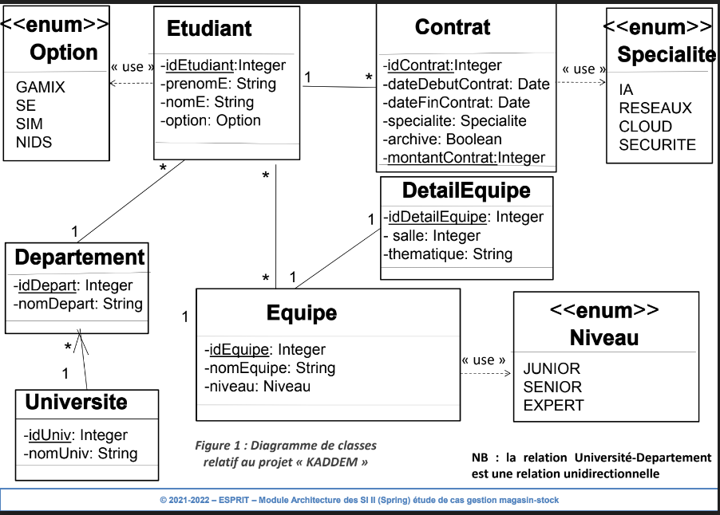

#  Projet académique : TP "Projet Kaddem" 
 
## « Kaddem » , c’est quoi?: 
C’est un projet qui vise à encourager les jeunes étudiants
à améliorer leurs compétences professionnelles notamment dans le cadre des
nouvelles tendances du monde de l’informatique.
## Objectif:
Dans le but de préparer les étudiants aux nouvelles exigences du marché
d’emploi, nous proposons de travailler sur le projet « KADDEM ».
## Donc concrètement, qu’est-ce-qu’on veut faire?
- On désire créer une application de gestion des contrats d’étudiants dans le cadre
du projet « Kaddem ». 
- Ce projet définit dans chaque département des universités adhérentes un
programme de répartition des étudiants par équipes.
- Chaque équipe aura l’un des niveaux (junior/senior ou expert) dans l’une des
spécialités suivantes: IA, réseaux, sécurité, cloud. 
- Ce projet propose donc aux étudiants des contrats selon la spécialité et le niveau.
- Chaque étudiant obtient un contrat s’il adhère à une équipe,
  Dans le cas ou il sera affecté à plusieurs équipe, il aura un contrat pour chaque
  activité avec une équipe.
- Le contrat constitue simplement un engagement moral entre l’étudiant et son
 université ➡️ il doit donc honorer son engagement en participant activement à
 l’évolution de son équipe.

## Diagramme de classes :

